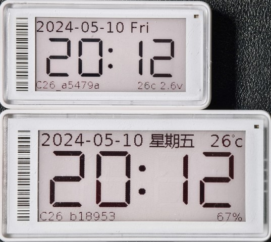

# cc2640r2-etag

cc2640r2 电子标签改电子时钟固件.

目前支持,
* cc2640r2l_2in13_ssd1680_250x122
* cc2640r2l_2in9_ssd1680a_296x128

单节或者双节 CR2450 电池供电.

## 编译

IAR 9.40 或 CCS 12.5

SDK: simplelink_cc2640r2_sdk_1_40_00_45

直接 IDE 编译出固件刷入即可. 

## 烧写

电子标签为 cjtag 2 wire, 需要 xds 或者 jlink 烧写器.

#### cc2640r2l_2in9_ssd1680a_296x128

|PIN|FOR|
|-|-|
|1|GND|
|2|VCC|
|3|TCLK|
|4|TMS|
|7|NRST|

## 低功耗蓝牙 BLE5

电子标签使用 BLE5 配置, 兼容 4.2.

可使用 tools 下 cc2640r2_etag.html (chrome 蓝牙) 配置, 或手机端 nRF connect App 配置.

GATT 配置, 

* Main Service UUID: FFF0,
* Characteristic 配置,
  - UUID: FFF1, Unix Epoch 时间, uint32, 默认为 0 (1970-01-01 00:00)
  - UUID: FFF2, 时区偏移分钟, int32, 默认为北京时区 (+8*60)
  - UUID: FFF3, 电池电压 mV, uint16
  - UUID: FFF4, 温度 摄氏度, int8, (-127 ~ +128)
