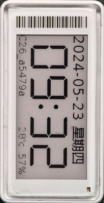
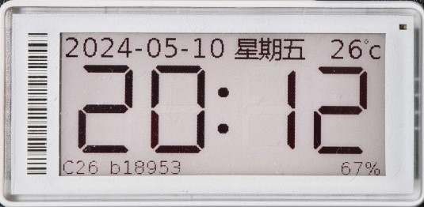
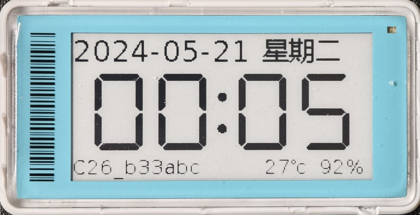
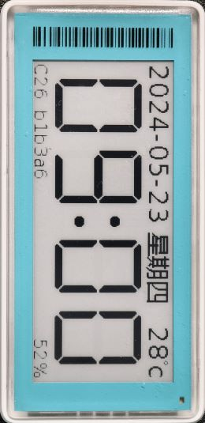
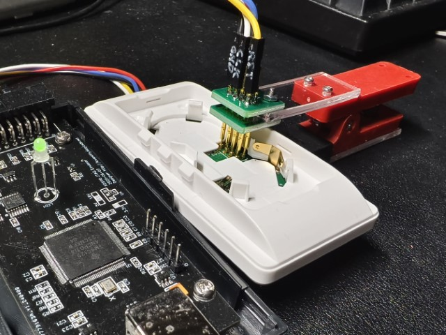
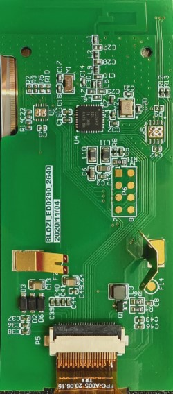
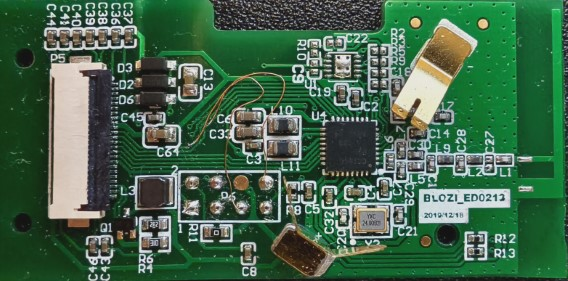
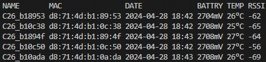

# cc2640r2-etag

cc2640r2 电子标签改电子时钟固件.
> 显示时钟日历，或静态图片。

## 目前支持

* BWR (黑白红)

    - cc2640r2l_2in13_ssd1680_250x122
    
    
 
    - cc2640r2l_2in66_ssd1680a_296x152
    
    
    
    - cc2640r2l_2in9_ssd1680a_296x128 **主要支持**

    

    - cc2640r2l_4in2_ssd1683_300x400

    

* BW (黑白)

    - cc2640r2l_2in13_ssd1680_bw_250x122

    
    
    - cc2640r2l_2in9_ssd1680_bw_296x128

    

单节或者双节 CR2450 电池供电.


### 8级灰度支持

通过控制 LUT，仅保留 Black 和 Red 的刷新，控制刷新电压及时间，在多次刷新下可获得灰度图片。


tools 下提供 bwr_gray8.act 调色板，便于在 Photoshop 里生成 BWR 色彩的8级灰度图像。


## 编译

CCS 12.4

SDK: simplelink_cc2640r2_sdk_1_40_00_45

直接 IDE 编译出固件刷入即可. 

## 烧写

电子标签为 cjtag 2 wire, 需要 xds 100v3 以上 或者 jlink v10 以上仿真器.

> 低成本也可选自制 xds110 仿真器 (功能和官方一样)




### Pin 定义
- cc2640r2l_2in9_ssd1680a_296x128
- cc2640r2l_2in9_ssd1680_bw_296x128



|PIN|FOR|
|-|-|
|1|GND|
|2|VCC|
|3|TCK|
|4|TMS|
|7|NRST|


- cc2640r2l_2in13_ssd1680_250x122
- cc2640r2l_2in13_ssd1680_bw_250x122



PIN 定义同上。


### 保留 SNV 数据

固件配置 SNV (非易失存储器) 为单页模式，数据保存在 FLash 中第 30 页中。

在首次烧录后，如需保留 LUT 等 SNV 设置，请在烧写器 (如 SmartRF Flash Programmer 2) 跳过第 30 页，设置即可保留。

## 低功耗蓝牙 BLE5

电子标签可使用 BLE5 进行配置。

可使用 tools 下 cc2640r2_etag.html (chrome 蓝牙) 配置, 或手机端 nRF connect App 配置.

GATT 配置, 

* Main Service UUID: FFF0,
* Characteristic 配置,
  - UUID: FFF1, Unix Epoch 时间, uint32, 默认为 0 (1970-01-01 00:00)
  - UUID: FFF2, 时区偏移分钟, int32, 默认为北京时区 (+8*60)
  - UUID: FFF3, 电池电压 mV, uint16
  - UUID: FFF4, 温度 摄氏度, int8, (-127 ~ +128)
  - UUID: FFF5, RTC 微调, int8, (-5 ~ +5)
  - UUID: FFFE, EPD 服务, 图片模式、灰度刷新、内置LUT更新等

### Advertising

本固件通过 BLE Adv 中的 Service Data 通告当前 etag 的数据，格式如下

```
UUID, MAC address, Unix Epoch Time, Temperature, Battery Level
```

通告间隔为 1s。

可通过 ble5_ctrl.py 批量获得近距离 etag 的信息。



## Webtools

当前配置能力由 cc2640r2_etag.html 完成，需使用支持 BLE5 蓝牙的 Chrome/Edge 浏览器打开。

时钟模式功能，
1. 获取当前 etag 的信息
2. 一键设置当前时间、当前时区、RTC 微调等

图片模式，
1. 选择 BWR 三色图像 (默认刷新，15秒左右)
2. 选择 BWR 灰度图像 (8级灰度刷新，2分钟左右)

SNV 功能，
1. 保存当前设置 (时区、RTC 微调，模式等)
2. 保存和查看自定义 LUT (可定义 3 个LUT)
